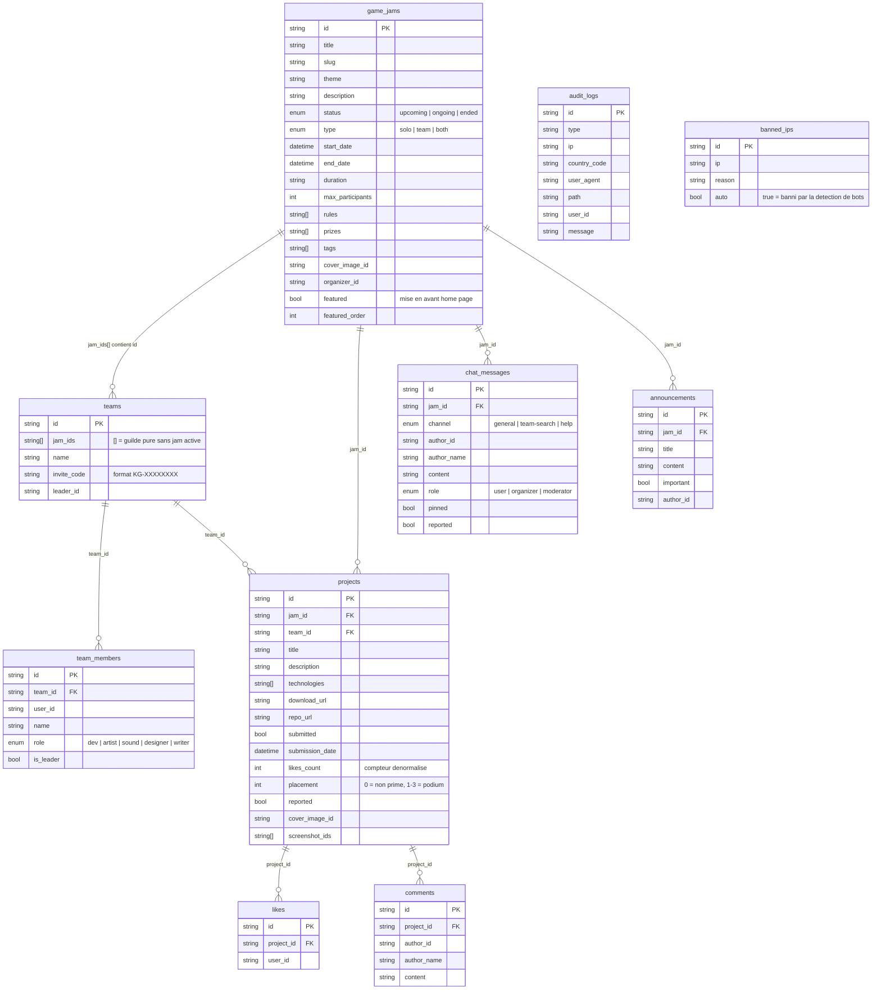

# KonfiturGame — Schéma de la base de données

Base de données Appwrite : `konfitur-db`
Source de vérité versionnée : `appwrite.json` (racine du repo, section `tables`)

---

## Diagramme ERD



---

## Schéma détaillé des collections

### `game_jams`

| Attribut | Type | Requis | Notes |
|----------|------|--------|-------|
| `title` | String(256) | Oui | |
| `slug` | String(256) | Oui | URL-friendly |
| `theme` | String(512) | Oui | |
| `description` | String(4096) | Oui | |
| `status` | Enum | Oui | `upcoming`, `ongoing`, `ended` — le code calcule le statut réel depuis les dates à la lecture (`computeJamStatus`, source de vérité : `start_date`/`end_date`) ; la colonne stockée est synchronisée par la fonction `update-jam-status` (cron 5 min) |
| `type` | Enum | Oui | `solo`, `team`, `both` |
| `start_date` | DateTime | Oui | |
| `end_date` | DateTime | Oui | |
| `duration` | String(32) | Oui | Ex : "72h" |
| `max_participants` | Integer | Non | |
| `rules[]` | String[](4096) | Non | Liste des règles |
| `prizes[]` | String[](512) | Non | Liste des prix |
| `tags[]` | String[](64) | Non | Tags de catégorie |
| `cover_image_id` | String(256) | Non | ID fichier bucket `jam-covers` |
| `organizer_id` | String(36) | Oui | User ID Appwrite |
| `featured` | Boolean | Non | Défaut `false` — la home page n'affiche que les jams `featured: true` |
| `featured_order` | Integer | Non | Défaut 0 — ordre d'affichage sur la home |

### `teams` (guildes)

| Attribut | Type | Requis | Notes |
|----------|------|--------|-------|
| `jam_ids[]` | String[](36) | Non | `[]` = guilde pure sans jam active |
| `name` | String(256) | Oui | |
| `invite_code` | String(16) | Oui | Format `KG-XXXXXXXX` |
| `leader_id` | String(36) | Oui | User ID Appwrite |
| `project_id` | String(36) | Non | **Déprécié** — colonne résiduelle non utilisée par le code. Les projets sont retrouvés par `(team_id, jam_id)` |

> Query pour retrouver les équipes d'une jam : `Query.contains('jam_ids', jamId)`

### `team_members`

| Attribut | Type | Requis | Notes |
|----------|------|--------|-------|
| `team_id` | String(36) | Oui | |
| `user_id` | String(36) | Oui | |
| `name` | String(128) | Oui | Nom affiché |
| `role` | Enum | Oui | `dev`, `artist`, `sound`, `designer`, `writer` |
| `is_leader` | Boolean | Oui | |

### `projects`

| Attribut | Type | Requis | Notes |
|----------|------|--------|-------|
| `jam_id` | String(36) | Oui | |
| `team_id` | String(36) | Oui | |
| `title` | String(256) | Oui | |
| `description` | String(4096) | Oui | |
| `technologies[]` | String[](64) | Non | |
| `download_url` | String(2048) | Non | |
| `repo_url` | String(2048) | Non | |
| `submitted` | Boolean | Oui | |
| `submission_date` | DateTime | Non | |
| `likes_count` | Integer | Non | Défaut 0, min 0 — compteur dénormalisé, incrémenté/décrémenté par `toggleLike` |
| `placement` | Integer | Non | Défaut 0 — `0` = non primé, `1`/`2`/`3` = rang au podium, désigné par l'organisateur après la fin de la jam |
| `reported` | Boolean | Non | Défaut `false` — signalement pour modération |
| `cover_image_id` | String(256) | Non | Bucket `project-assets` |
| `screenshot_ids[]` | String[](256) | Non | Bucket `project-assets` |

### `chat_messages`

| Attribut | Type | Requis | Notes |
|----------|------|--------|-------|
| `jam_id` | String(36) | Oui | |
| `channel` | Enum | Oui | `general`, `team-search`, `help` |
| `author_id` | String(36) | Oui | |
| `author_name` | String(128) | Oui | |
| `content` | String(2048) | Oui | |
| `role` | Enum | Oui | `user`, `organizer`, `moderator` |
| `pinned` | Boolean | Non | Défaut `false` |
| `reported` | Boolean | Non | Défaut `false` — signalement pour modération |

### `announcements`

| Attribut | Type | Requis | Notes |
|----------|------|--------|-------|
| `jam_id` | String(36) | Oui | Jam ciblée |
| `title` | String(256) | Oui | |
| `content` | String(4096) | Oui | |
| `important` | Boolean | Oui | Affichage mis en avant |
| `author_id` | String(36) | Oui | |

### `likes`

| Attribut | Type | Requis | Notes |
|----------|------|--------|-------|
| `project_id` | String(36) | Oui | |
| `user_id` | String(36) | Oui | |

> Un document = un like d'un utilisateur sur un projet. Le like est **togglable** : un « unlike » supprime le document (permission `delete("users")`). L'unicité `(project_id, user_id)` est garantie par la logique applicative (`toggleLike` vérifie l'existence avant insertion).

### `comments`

| Attribut | Type | Requis | Notes |
|----------|------|--------|-------|
| `project_id` | String(36) | Oui | |
| `author_id` | String(36) | Oui | |
| `author_name` | String(128) | Oui | |
| `content` | String(2048) | Oui | |

### `audit_logs`

Permissions : `read("team:admin")` uniquement.

| Attribut | Type | Requis | Notes |
|----------|------|--------|-------|
| `type` | String(32) | Oui | Type d'événement loggé (page_view, error, admin_action…) |
| `ip` | String(45) | Non | IPv4 ou IPv6 |
| `country_code` | String(2) | Non | Code pays (géoloc optionnelle, `GEOIP_ENABLED`) |
| `user_agent` | String(512) | Non | |
| `path` | String(512) | Non | Chemin de la requête |
| `user_id` | String(64) | Non | |
| `message` | String(2048) | Non | Détail libre |

### `banned_ips`

Permissions : `read("team:admin")` uniquement.

| Attribut | Type | Requis | Notes |
|----------|------|--------|-------|
| `ip` | String(45) | Oui | IPv4 ou IPv6 |
| `reason` | String(256) | Non | |
| `auto` | Boolean | Non | Défaut `false` — `true` = banni automatiquement par la détection de bots |

---

## Buckets de stockage

| Bucket ID | Contenu | Taille max | Notes |
|-----------|---------|-----------|-------|
| `jam-covers` | Images de couverture des jams | 2 Mo | jpg/jpeg/png/webp |
| `project-assets` | Covers et screenshots des projets | 10 Mo | jpg/jpeg/png/webp, file security |
| `project-builds` | Builds jouables des projets | 150 Mo | zip uniquement, antivirus ClamAV activé |
| `avatars` | Photos de profil | 1 Mo | jpg/jpeg/png/webp |

Les buckets sont versionnés dans `appwrite.json` (section `buckets`).

---

## Migrations du schéma — Appwrite CLI

Le schéma est versionné dans `appwrite.json` et se manipule avec l'Appwrite CLI (version compatible serveur — voir le tableau de compatibilité dans `MISE-A-JOUR.md §4`).

```bash
# Configurer le client (une fois)
appwrite client \
  --endpoint https://api.konfiturgame.fr/v1 \
  --project-id 69a19b8d00175f1d0b99 \
  --key "$APPWRITE_API_KEY"

# Capturer le schéma actuel du serveur dans appwrite.json
appwrite pull tables        # collections/tables
appwrite pull buckets       # buckets Storage
appwrite pull teams         # teams (admins)

# Appliquer appwrite.json vers le serveur
appwrite push tables --force
appwrite push buckets
appwrite push teams

# Tout pousser d'un coup (tables + buckets + teams + fonctions)
appwrite push all
```

> Depuis Appwrite 1.9 / CLI 17+, `appwrite pull collections` et `appwrite push collections` sont **dépréciées** au profit de `pull tables` / `push tables` (API TablesDB). Les deux fonctionnent encore, mais utiliser `tables`.

**Workflow de modification du schéma :**

1. Modifier dans la console Appwrite (dev) — Databases → `konfitur-db`
2. `appwrite pull tables` → capture dans `appwrite.json`
3. `git diff appwrite.json` → vérifier le changement
4. Mettre à jour les types TypeScript (`frontend/src/lib/appwrite/types.ts`, `frontend/src/types/index.ts`) et ce document
5. Commit + push sur `main` → la CI déploie le schéma automatiquement (job `deploy-schema`, voir `CI-CD.md`)

Pour la migration de **version** d'Appwrite (montée 1.x → 1.y, `cli.php migrate`), voir `MISE-A-JOUR.md §4`.

---

## Notes architecturales

### Guildes multi-jam

La relation `game_jams ↔ teams` est many-to-many côté teams : `jam_ids[]` est un tableau d'IDs de jams. Une guilde peut être inscrite à 0, 1 ou plusieurs jams simultanément.

### Projets découplés des équipes

Un projet est retrouvé par `(team_id, jam_id)` — ce qui permet à une guilde de soumettre un projet différent par jam. La colonne `project_id` sur `teams` est un résidu déprécié, non lu par le code.

### Deux classements distincts

- **Popularité (likes)** — automatique : compteur `likes_count` alimenté par les likes togglables des utilisateurs. Sert au tri des projets d'une jam et à la section « Projets les plus aimés » de la home.
- **Podium (placement)** — éditorial : l'organisateur désigne le top 3 (`placement` 1/2/3) depuis son dashboard, uniquement après `end_date`. Aucun lien entre les deux.

### Utilisateurs Appwrite

Les utilisateurs ne sont pas dans `konfitur-db` — ils sont gérés nativement par Appwrite (Auth). Les `user_id` dans les collections font référence à l'ID Appwrite de l'utilisateur. L'équipe `admins` (accès `/admin` et lectures `team:admin`) est également native Appwrite, versionnée dans `appwrite.json` (section `teams`).

### Création du schéma

- Source de vérité : `appwrite.json` → `appwrite push tables` / `push buckets` / `push teams`
- Scripts historiques (toujours utiles pour les **données de test**) : `scripts/seed-data.sh`, `scripts/create-log-collections.sh`

---

*KonfiturGame · Appwrite 1.9.0 · Base : `konfitur-db` · Mis à jour : 2026-07-14*
