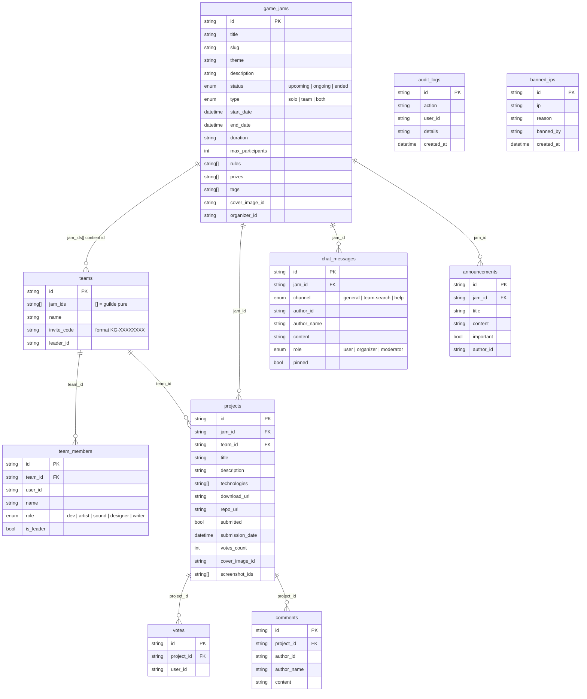

# KonfiturGame — Schéma de la base de données

Base de données Appwrite : `konfitur-db`

---

## Diagramme ERD

---

## Notes architecturales

### Guildes multi-jam
La relation `game_jams ↔ teams` est **many-to-many côté teams** : le champ `jam_ids[]` est un tableau d'IDs de jams. Une guilde peut être inscrite à 0, 1 ou plusieurs jams simultanément.

Query pour retrouver les équipes d'une jam : `Query.contains('jam_ids', jamId)`

### Projets découplés des équipes
`project_id` a été retiré de `teams`. Un projet est retrouvé par la combinaison `(team_id, jam_id)` — ce qui permet à une guilde de soumettre un projet différent par jam.

### Unicité des votes
Un seul vote par `(project_id, user_id)` est techniquement garanti par la logique applicative (vérification avant insertion).

### Utilisateurs Appwrite
Les utilisateurs ne sont pas dans `konfitur-db` — ils sont gérés nativement par Appwrite (collection interne `_console_users`). Les `user_id` dans les collections font référence à l'ID Appwrite de l'utilisateur.

---

## Buckets de stockage

| Bucket ID | Contenu | Taille max |
|-----------|---------|-----------|
| `jam-covers` | Images de couverture des jams | 5 Mo |
| `project-assets` | Screenshots et builds | 20 Mo |
| `avatars` | Photos de profil | 2 Mo |

---

*Schéma — KonfiturGame · Appwrite 1.8.0 · Base : `konfitur-db` · Mis à jour : 2026-04-16*
