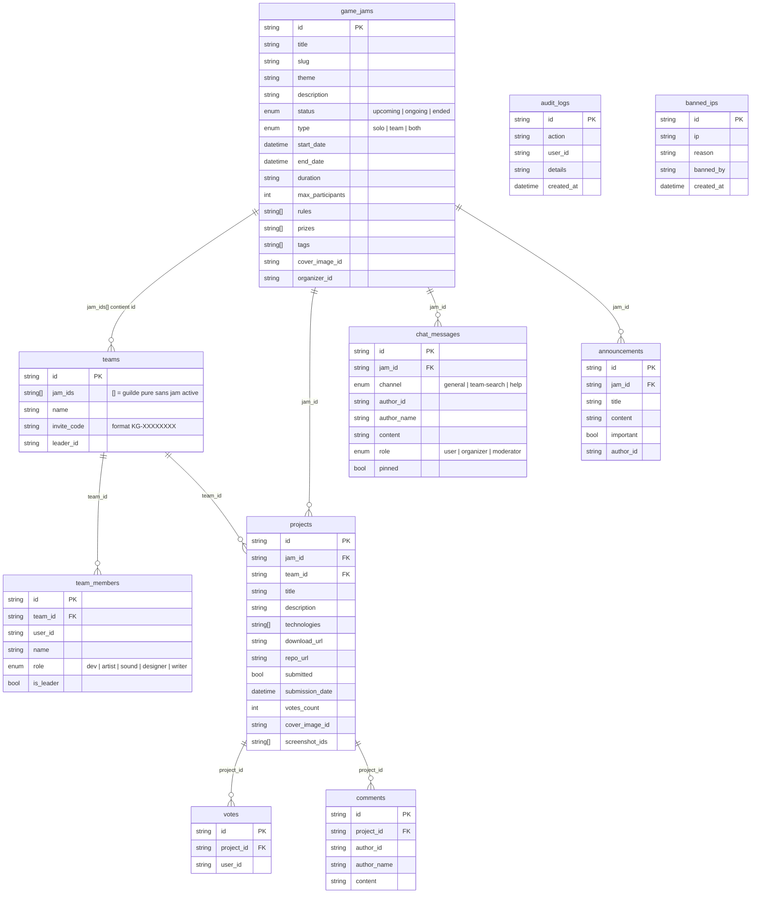

# KonfiturGame — Schéma de la base de données

Base de données Appwrite : `konfitur-db`

---

## Diagramme ERD

---

## Schéma détaillé des collections

### `game_jams`

| Attribut | Type | Requis | Notes |
|----------|------|--------|-------|
| `title` | String(256) | Oui | |
| `slug` | String(256) | Oui | URL-friendly |
| `theme` | String(512) | Oui | |
| `description` | String(4096) | Oui | |
| `status` | Enum | Oui | `upcoming`, `ongoing`, `ended` |
| `type` | Enum | Oui | `solo`, `team`, `both` |
| `start_date` | DateTime | Oui | |
| `end_date` | DateTime | Oui | |
| `duration` | String(32) | Non | Ex : "72h" |
| `max_participants` | Integer | Non | |
| `rules[]` | String[] | Non | Liste des règles |
| `prizes[]` | String[] | Non | Liste des prix |
| `tags[]` | String[] | Non | Tags de catégorie |
| `cover_image_id` | String(256) | Non | ID fichier bucket `jam-covers` |
| `organizer_id` | String(36) | Oui | User ID Appwrite |

### `teams` (guildes)

| Attribut | Type | Requis | Notes |
|----------|------|--------|-------|
| `jam_ids[]` | String[] | Oui | `[]` = guilde pure sans jam active |
| `name` | String(256) | Oui | |
| `invite_code` | String(16) | Oui | Format `KG-XXXXXXXX` |
| `leader_id` | String(36) | Oui | User ID Appwrite |

> `project_id` a été supprimé. Les projets sont retrouvés par `(team_id, jam_id)`.
> Query pour retrouver les équipes d'une jam : `Query.contains('jam_ids', jamId)`

### `team_members`

| Attribut | Type | Requis | Notes |
|----------|------|--------|-------|
| `team_id` | String(36) | Oui | |
| `user_id` | String(36) | Oui | |
| `name` | String(128) | Oui | Nom affiché |
| `role` | Enum | Oui | `dev`, `artist`, `sound`, `designer`, `writer` |
| `is_leader` | Boolean | Oui | |

### `projects`

| Attribut | Type | Requis | Notes |
|----------|------|--------|-------|
| `jam_id` | String(36) | Oui | |
| `team_id` | String(36) | Oui | |
| `title` | String(256) | Oui | |
| `description` | String(4096) | Oui | |
| `technologies[]` | String[] | Non | |
| `download_url` | String(2048) | Non | |
| `repo_url` | String(2048) | Non | |
| `submitted` | Boolean | Oui | |
| `submission_date` | DateTime | Non | |
| `votes_count` | Integer | Oui | Défaut 0 |
| `cover_image_id` | String(256) | Non | Bucket `project-assets` |
| `screenshot_ids[]` | String[] | Non | Bucket `project-assets` |

### `chat_messages`

| Attribut | Type | Requis | Notes |
|----------|------|--------|-------|
| `jam_id` | String(36) | Oui | |
| `channel` | Enum | Oui | `general`, `team-search`, `help` |
| `author_id` | String(36) | Oui | |
| `author_name` | String(128) | Oui | |
| `content` | String(2048) | Oui | |
| `role` | Enum | Oui | `user`, `organizer`, `moderator` |
| `pinned` | Boolean | Oui | Défaut false |

### `announcements`

| Attribut | Type | Requis | Notes |
|----------|------|--------|-------|
| `jam_id` | String(36) | Oui | Jam ciblée |
| `title` | String(256) | Oui | |
| `content` | String(4096) | Oui | |
| `important` | Boolean | Oui | Affichage mis en avant |
| `author_id` | String(36) | Oui | |

### `votes`

| Attribut | Type | Requis | Notes |
|----------|------|--------|-------|
| `project_id` | String(36) | Oui | |
| `user_id` | String(36) | Oui | |

> L'unicité `(project_id, user_id)` est garantie par la logique applicative (vérification avant insertion).

### `comments`

| Attribut | Type | Requis | Notes |
|----------|------|--------|-------|
| `project_id` | String(36) | Oui | |
| `author_id` | String(36) | Oui | |
| `author_name` | String(128) | Oui | |
| `content` | String(2048) | Oui | |

### `audit_logs`

| Attribut | Type | Requis | Notes |
|----------|------|--------|-------|
| `action` | String(256) | Oui | Type d'action loggée |
| `user_id` | String(36) | Non | |
| `details` | String(4096) | Non | JSON ou texte libre |
| `created_at` | DateTime | Oui | |

### `banned_ips`

| Attribut | Type | Requis | Notes |
|----------|------|--------|-------|
| `ip` | String(64) | Oui | IPv4 ou IPv6 |
| `reason` | String(512) | Non | |
| `banned_by` | String(128) | Non | User ID ou "auto-bot" |
| `created_at` | DateTime | Oui | |

---

## Buckets de stockage

| Bucket ID | Contenu | Taille max |
|-----------|---------|-----------|
| `jam-covers` | Images de couverture des jams | 5 Mo |
| `project-assets` | Screenshots et builds | 20 Mo |
| `avatars` | Photos de profil | 2 Mo |

---

## Notes architecturales

### Guildes multi-jam

La relation `game_jams ↔ teams` est many-to-many côté teams : `jam_ids[]` est un tableau d'IDs de jams. Une guilde peut être inscrite à 0, 1 ou plusieurs jams simultanément.

### Projets découplés des équipes

`project_id` a été retiré de `teams`. Un projet est retrouvé par `(team_id, jam_id)` — ce qui permet à une guilde de soumettre un projet différent par jam.

### Utilisateurs Appwrite

Les utilisateurs ne sont pas dans `konfitur-db` — ils sont gérés nativement par Appwrite (collection interne). Les `user_id` dans les collections font référence à l'ID Appwrite de l'utilisateur.

### Collections créées par script

- Collections principales (`game_jams` → `votes`) : `scripts/seed-data.sh`
- Collections de monitoring (`audit_logs`, `banned_ips`) : `scripts/create-log-collections.sh`

---

*KonfiturGame · Appwrite 1.8.0 · Base : `konfitur-db` · Mis à jour : 2026-06-28*
